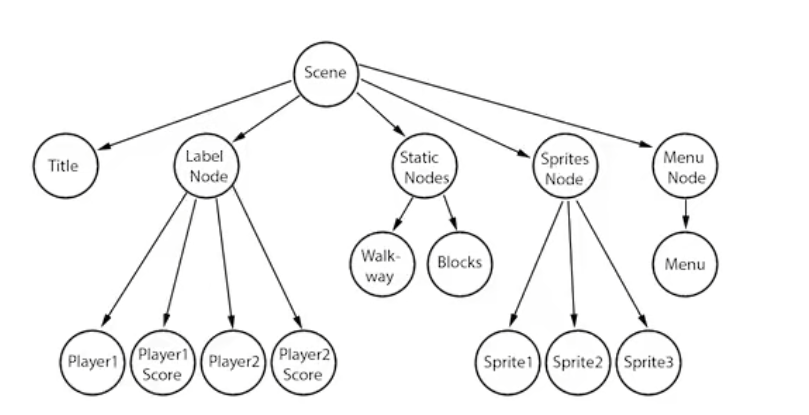

# 1.8 基本概念

### 1.8.1 场景

Cocos Creator 是有一个一个的游戏场景组成,场景是一个树形结构,场景是由`有各种层级关系的节点`组成;

**场景编辑器**是内容创作的核心工作区域,您将使用它选择和摆放场景图像,角色,特效,UI等各类游戏元素.在这个工作区域里,您可以选中并通过**变换工具**修改节点的位置,旋转,缩放,尺寸等属性,并可以获得所见即所得的场景效果预览.

### 1.8.2 节点和组件

cocos creator 的工作流程就是以组件式开发为核心的,组件式架构也称作**组件-实体系统**(或Entity-Component System), 简单地说,就是以组合而并非继承的方式进行实体的构建.

在cocos creator中,**节点(Node)**是承载组件的实体,我们通过将具有各种功能的**组件(Component)**挂载到节点上,来让节点具有各式各样的表现和功能.接下来我们看看如何在场景中创建节点和添加组件.

### 1.8.3 坐标

在cocos creator中采用的是右手坐标系,向右为X轴正方向,向上为Y轴正方向,延屏幕向外为Z轴正方向.

### 1.8.4 事件响应

 1. 触摸事件

    #### (1) this.node.on

    * `TOUCHU_START` 当手指触摸到屏幕时

    - `TOUCH_MOVE`当手指在屏幕上移动时

    - `TOUCH_END`当手指在目标节点区域内离开屏幕时
    - `TOUCH_CANCEL`当手指在目标节点区域外离开屏幕时

    #### (2) 事件的三个阶段和事件冒泡

    鼠标或触摸事件会被系统调用dispatchEvent方法触发,触发的过程包含三个阶段:

    - 捕获阶段: 派发事件给捕获目标(通过`_getCapturingTargets`获取),比如,节点树中注册了捕获阶段的父节点,从根节点开始派发直到目标节点.

    - 目标阶段: 派发给目标节点的监听器

    - 冒泡阶段: 派发事件给冒泡目标(通过`_getBubblingTargets`获取),比如,节点树中注册了冒泡阶段的父节点,从目标节点开始派发直到根节点.

      同时您可以将事件派发到父节点或者通过调用stopPropagation拦截它

      推荐使用这种方式来监听节点上的触摸或鼠标事件,请不要在节点上直接使用cc.eventManager

      你也可以注册自定义事件到节点上,并通过emit方法触发此类事件,对于这类事件,不会发生捕获冒泡阶段,只会直接派发给注册在该节点上的监听器

      你可以通过在emit方法调用时在type之后传递额外的参数作为事件回调的参数列表

    

