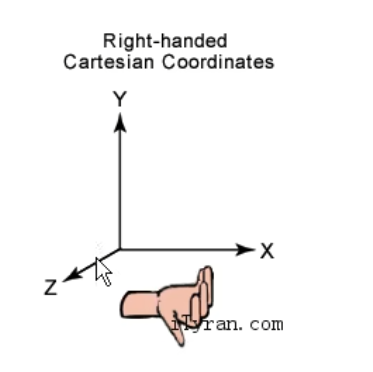

# 1快速入门

## 1.8 基本概念

### 1.8.1 场景

Cocos Creator 是有一个一个的游戏场景组成,场景是一个树形结构,场景是由`有各种层级关系的节点`组成;

**场景编辑器**是内容创作的核心工作区域,您将使用它选择和摆放场景图像,角色,特效,UI等各类游戏元素.在这个工作区域里,您可以选中并通过**变换工具**修改节点的位置,旋转,缩放,尺寸等属性,并可以获得所见即所得的场景效果预览.

### 1.8.2 节点和组件

cocos creator 的工作流程就是以组件式开发为核心的,组件式架构也称作**组件-实体系统**(或Entity-Component System), 简单地说,就是以组合而并非继承的方式进行实体的构建.

在cocos creator中,**节点(Node)**是承载组件的实体,我们通过将具有各种功能的**组件(Component)**挂载到节点上,来让节点具有各式各样的表现和功能.接下来我们看看如何在场景中创建节点和添加组件.


### 1.8.3 坐标

在cocos creator中采用的是右手坐标系,向右为X轴正方向,向上为Y轴正方向,延屏幕向外为Z轴正方向.




### 1.8.4 事件响应

 1. 触摸事件

    #### (1) this.node.on

    * `TOUCHU_START` 当手指触摸到屏幕时

    - `TOUCH_MOVE`当手指在屏幕上移动时

    - `TOUCH_END`当手指在目标节点区域内离开屏幕时
    - `TOUCH_CANCEL`当手指在目标节点区域外离开屏幕时

    #### (2) 事件的三个阶段和事件冒泡

    鼠标或触摸事件会被系统调用dispatchEvent方法触发,触发的过程包含三个阶段:

    - 捕获阶段: 派发事件给捕获目标(通过`_getCapturingTargets`获取),比如,节点树中注册了捕获阶段的父节点,从根节点开始派发直到目标节点.

    - 目标阶段: 派发给目标节点的监听器

    - 冒泡阶段: 派发事件给冒泡目标(通过`_getBubblingTargets`获取),比如,节点树中注册了冒泡阶段的父节点,从目标节点开始派发直到根节点.

      同时您可以将事件派发到父节点或者通过调用stopPropagation拦截它

      推荐使用这种方式来监听节点上的触摸或鼠标事件,请不要在节点上直接使用cc.eventManager

      你也可以注册自定义事件到节点上,并通过emit方法触发此类事件,对于这类事件,不会发生捕获冒泡阶段,只会直接派发给注册在该节点上的监听器

      你可以通过在emit方法调用时在type之后传递额外的参数作为事件回调的参数列表

 2. 键盘事件

    #### (1) 事件类型

    - #### KEY_DOWN

      > 当按下按键时触发的事件

    - #### KEY_UP

      > 当松开按键时触发的事件

    #### (2) 事件类型回调方法

    ```js
    cc.systemEvent.on(cc.SystemEvent.EventType.KEY_DOWN,function(e){
        console.log("KEY_DOWN",e.keyCode)
    },this);
    cc.systemEvent.on(cc.SystemEvent.EventType.KEY_UP,function(e){
        console.log("KEY_UP",e.keyCode)
        switch(e.keyCode){
            case cc.macro.KEY.space:{
                console.log("空格事件")
            }
        }
    },this);
    ```

    3. 相应自定义事件

       #### (1) 监听事件

       ```js
       //自定义事件类型
       this.node.on("fire",function(msg){
           cc.log("自定义事件:","fire",msg)
       },this);
       ```
       
       ##### (2) 发射方式
       
       两种方式 emit 和 dispatchEvent
       
       ```js
       // 发射事件 emit
       // 只能派送给自己
       this.node.emit("fire","开火!");
       
       // 可以做事件传递
       // 参数2--> 表示事件是否向上传递
       let msgForDispatchEvent = new cc.Event.EventCustom("remoteFire",true);
       msgForDispatchEvent.detail = "远程开火!";
       this.node.dispatchEvent(msgForDispatchEvent)
       ```
       
       

# 2 游戏资源管理

从本质上说,每个游戏都是有种类繁多,数量庞大的资源构成的,因此,管理包括图片,声音,字体,粒子,地图等多媒体资源是一款游戏引擎的核心功能.资源管理的知识主要有几个方面:包括对于资源的组织,运行期对于资源的载入,清理及对于资源的操作以及资源的优化.

本节主要介绍图片,音乐音效,预置体,字体,粒子,瓦片地图等资源在Cocos Creator中的管理和使用,将从资源组织,资源操作及资源优化等方面分别介绍资源的管理方式.

## 2.1 图片资源的管理

图片资源又称贴图,是游戏中,尤其是2D游戏中绝大部分对象的渲染源,图片资源一般由制图软件制作而成并输出成游戏引擎支持的格式,目前支持的格式包括JPG和PNG两种,除了单张图片外,Cocos Creator 还支持图集资源的导入和自动图集资源的生成功能.

## 2.1.1 图片资源的导入

图片资源导入的方式非常简单,就是将图片资源复制到资源和管理器所在的目录下,在资源管理器中的对应目录下就可以看到相对应的图片资源,在对应的资源管理器中会显示自身图片的缩略图.以方便你找到想选的那个图片,单击三角形按钮就可以打开图片的子资源,也就是说单击开三角形以后可以看到同名的SpriteFrame,SpriteFrame是精灵类用来显示图像的对象,对于图片资源集来说,可以有多个图片资源在一个资源名下,直接将SpriteFrame或者图像资源从资源管理器中拖拽到场景编辑器,或者属性监视器的对应属性下时,就可以设置节点的图片显示,点击对应的图片资源文件,或者SpriteFrame就可以看到对应的属性检查器中可以编辑的属性,但是目前这些属性的编辑暂时无法影响图片资源在游戏中使用时的属性,应该是为未来引擎的扩展预留的编辑接口


