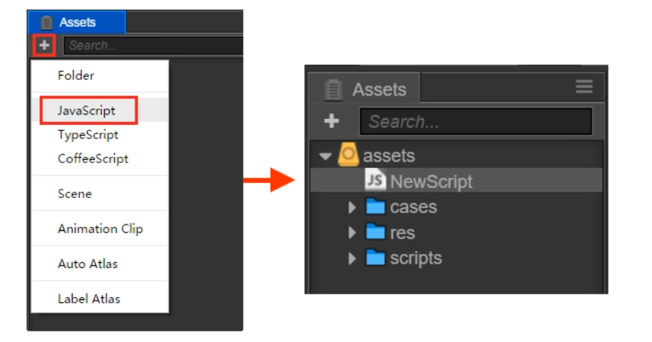

# 脚本编程

Cocos Creator 的脚本主要是通过扩展组件来进行开发的. 目前Cocos Creator 支持**JavaScript** 和 **TypeScript**两种脚本语言.通过编写脚本组件,并将它赋予到场景节点中来驱动场景中的物体.

在组件脚本的编写过程中,你可以通过声明属性,将脚本中需要调节的变量映射到**属性检查器**(Properties)中,供策划和美术调整.与此同时,你也可以通过注册特定的回调函数,来帮助你初始化,更新甚至销毁节点.

## 节点和组件

### 1.1 创建和使用脚本组件

- 创建脚本组件

  在cocos creator中,脚本也是资源的一部分.你可以在资源编辑器中通过点击"创建"按钮来添加病选择JavaScript或者TypeScript来创建一份组件脚本.此时你会在你的资源编辑器中得到一份新的脚本

