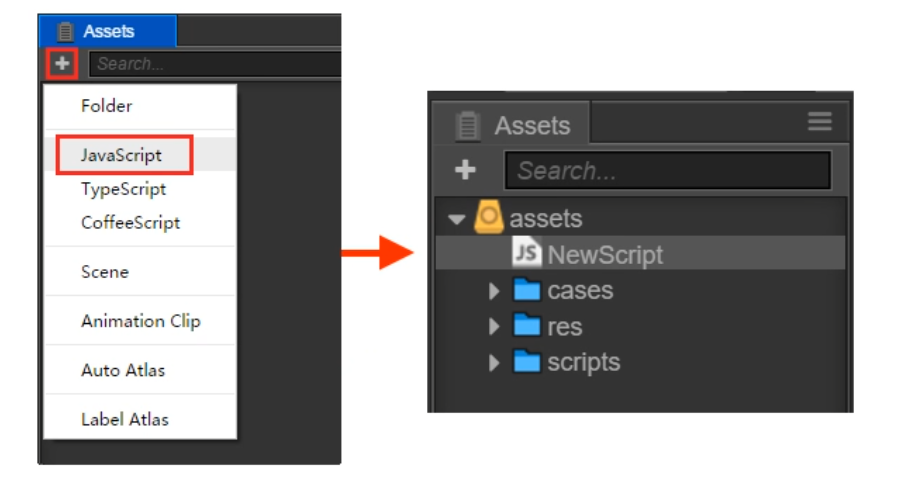

# 脚本编程

Cocos Creator 的脚本主要是通过扩展组件来进行开发的. 目前Cocos Creator 支持**JavaScript** 和 **TypeScript**两种脚本语言.通过编写脚本组件,并将它赋予到场景节点中来驱动场景中的物体.

在组件脚本的编写过程中,你可以通过声明属性,将脚本中需要调节的变量映射到**属性检查器**(Properties)中,供策划和美术调整.与此同时,你也可以通过注册特定的回调函数,来帮助你初始化,更新甚至销毁节点.

## 节点和组件

### 1.1 创建和使用脚本组件

- 创建脚本组件

  在cocos creator中,脚本也是资源的一部分.你可以在资源编辑器中通过点击"创建"按钮来添加病选择JavaScript或者TypeScript来创建一份组件脚本.此时你会在你的资源编辑器中得到一份新的脚本



**注意**:用户也可以通过直接拖拽脚本资源到**属性检查器**的方式来添加脚本

### 1.2 使用cc.Class 生命类型

`cc.Class` 是一个很常用的API,用于声明cocos creator中的类,为了方便区分,我们把使用cc.Class声明的类叫做**CCClass**

- 定义一个CCClass

  调用`cc.Class`,传入一个原型对象,在原型对象中以键值对的形式设定所需要的类型参数,就能创建出所需要的类.

  ```js
  let Sprite = cc.Class({
      name:"sprite",
  })
  ```

  以上代码用cc.Class创建了一个类型,并且赋值给了`Sprite`变量,同时还将类名设为"sprite",类名用于序列化,一般可以省略.

- 实例化

  `Sprite`变量保存的是一个JavaScript构造函数,可以直接new出一个对象

  ```js
  let obj = new Sprite()
  ```

- 判断类型

  需要做类型判断时,可以用JavaScript原生的`instanceof`

  ```js
  cc.log(obj instanceof Sprite); // true
  ```

- 实例方法

  ```js
  let Sprite = cc.CLass({
      // 声明一个叫 "print" 的实例方法
      print: function() {}
  })
  ```

  


