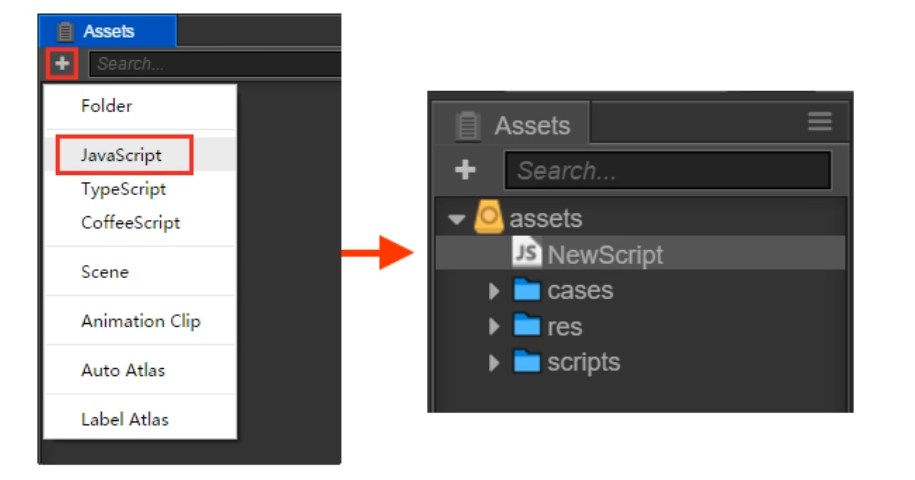
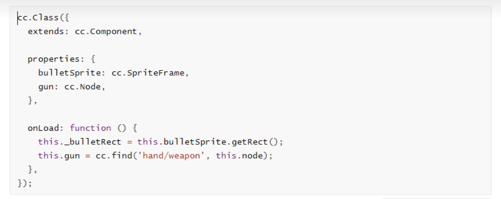
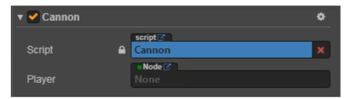

# 脚本编程

Cocos Creator 的脚本主要是通过扩展组件来进行开发的. 目前Cocos Creator 支持**JavaScript** 和 **TypeScript**两种脚本语言.通过编写脚本组件,并将它赋予到场景节点中来驱动场景中的物体.

在组件脚本的编写过程中,你可以通过声明属性,将脚本中需要调节的变量映射到**属性检查器**(Properties)中,供策划和美术调整.与此同时,你也可以通过注册特定的回调函数,来帮助你初始化,更新甚至销毁节点.

## 1 节点和组件

### 1.1 创建和使用脚本组件

- 创建脚本组件

  在cocos creator中,脚本也是资源的一部分.你可以在资源编辑器中通过点击"创建"按钮来添加病选择JavaScript或者TypeScript来创建一份组件脚本.此时你会在你的资源编辑器中得到一份新的脚本



**注意**:用户也可以通过直接拖拽脚本资源到**属性检查器**的方式来添加脚本

### 1.2 使用cc.Class 生命类型

`cc.Class` 是一个很常用的API,用于声明cocos creator中的类,为了方便区分,我们把使用cc.Class声明的类叫做**CCClass**

- 定义一个CCClass

  调用`cc.Class`,传入一个原型对象,在原型对象中以键值对的形式设定所需要的类型参数,就能创建出所需要的类.

  ```js
  let Sprite = cc.Class({
      name:"sprite",
  })
  ```

  以上代码用cc.Class创建了一个类型,并且赋值给了`Sprite`变量,同时还将类名设为"sprite",类名用于序列化,一般可以省略.

- 实例化

  `Sprite`变量保存的是一个JavaScript构造函数,可以直接new出一个对象

  ```js
  let obj = new Sprite()
  ```

- 判断类型

  需要做类型判断时,可以用JavaScript原生的`instanceof`

  ```js
  cc.log(obj instanceof Sprite); // true
  ```

- 实例方法

  ```js
  let Sprite = cc.CLass({
      // 声明一个叫 "print" 的实例方法
      print: function() {}
  })
  ```


### 1.3 声明自定义属性

#### 1.3.1 简单声明

在多数情况下,我们都可以使用简单声明.

**(1) 基本类型**

- 当声明的属性为基本JavaScript类型时,可以直接赋予默认值:

  ```JavaScript
  properties: {
          height: 20, // number
          type: "actor", // string 
          loaded: false, // boolean
          target: null, // object
          // foo: {
          //     // ATTRIBUTES:
          //     default: null,        // The default value will be used only when the component attaching
          //                           // to a node for the first time
          //     type: cc.SpriteFrame, // optional, default is typeof default
          //     serializable: true,   // optional, default is true
          // },
          // bar: {
          //     get () {
          //         return this._bar;
          //     },
          //     set (value) {
          //         this._bar = value;
          //     }
          // },
      },
  ```

- 当声明的属性具备类型时(如:`cc.Node`,`cc.Vec2`等), 可以在声明处填写他们的构造函数来完成声明,如:

  ```JavaScript
  properties:{
      target: cc.Node,
      pos: cc.Vec2,
  }
  ```

**(2) 数组类型**

当声明属性是一个数组时,可以在声明处填写他们的类型或构造函数来完成声明,如:

```JavaScript
properties:{
    any:[],					//不定义具体类型的数组
    bools:[cc.Boolean],
    strings:[cc.String],
    floats:[cc.Float],
    ...
}
```


#### 1.3.2 完整声明

有些情况下,我们需要为属性声明添加参数,这些参数控制了属性在**属性检查器**中的显示方式,以及属性在场景序列化过程中的行为.

**(1) 基本类型**

```js
properties:{
    score:{
        default:0,
        displayName:"得分",
        tooltip:"设置玩家初始得分",
    }
}
```


以上代码为`score`属性设置了三个参数`default`,`displayName`和`tooltip`.这几个参数分别指定了`score`的默认值为0,在**属性检查器**里,其属性名将显示为:"Score(player)",并且当鼠标移到参数上时,显示对应的Tooltip

下面是常用参数:

- **default**:设置属性的默认值,这个默认值仅在组件**第一次**添加到节点上时才会用到
- **type**:限定属性的数据类型
- **visible**:设为false则不再**属性检查器**面板中显示该属性
- **serializable**:设为false则不序列化(保存)该属性
- **displayName**:在**属性检查器**面板中显示成指定名字
- **tooltip**:在**属性检查器**面板中添加属性的Tooltip

**(2) 数组类型**

数组的default必须设置为`[]`,如果要在**属性检查器**中编辑,还需要设置type为构造函数,枚举,或者`cc.Integer`,`cc.Float`,`cc.Boolean`和`cc.String`.

```js
properties:{
    name:{
        default:[],
        type: [cc.String]		//	用type指定数组每个元素都是字符串类型
    },
    enemies:{
        default:[],
        type: [cc.Node]			//	type 同样写成数组,提高代码可读性
    },
}
```


### 1.4 脚本生命周期的回调函数

游戏运行的时期的自动执行相关脚本,用户不需要手工调用他们.

目前提供给用户的生命周期回调函数主要有:

- onLoad
- onEnable
- start
- update
- lateUpdate
- onDisbale
- onDestroy

#### 1.4.1 onLoad

组件脚本的初始化阶段,我们提供了`onLoad`回调函数.`onLoad`回调函数会在节点首次激活时触发,比如所在的场景被载入,或者在节点被激活的情况下,在`onLoad`阶段,保证了你可以获取到场景中的其他节点,以及节点关联的资源数据.onLoad总是会在任何start方法调用前执行,这能用于安排脚本的初始化顺序.通常我们会在`onLoad`阶段去做一些初始化相关的操作.例如:




#### 1.4.2 onEnable

当组件的`enable`属性从`false`变为`true`时,或者所在节点的`active`属性从`false`变为`true`时,会激活`onEnable`回调.倘若节点第一次被创建且`enable`为`true`,则会在`onLoad`之后,`start`之前被调用

#### 1.4.3 start

`start`回调函数会在组件第一次激活前,也就是第一次执行`update`之前触发.`start`通常用于初始化一些中间状态的数据,这些数据可能在update时会发生改变,并且被频繁的enable和disable

#### 1.4.4 update 

游戏开发中的一个关键点是在每一帧渲染前更新物体的行为,状态和方位.这些更新操作通常都放在`update`回调中.

```js
cc.Class({
    extends:cc.Component,
    
    update:function(dt){
        this.node.y+=1;
    }
})
```

#### 1.4.5 lateUpdate

`update`会在所有动画更新前执行,但如果我们要在动效(如动画,粒子,物理等)更新之后才进行一些额外操作,或希望在所有组件的`update`都执行完之后进行其他操作,那就需要用到`lateUpdate`回调.

```js
cc.Class({
    extends:cc.Component,
    lateUpdate:function(dt){
        this.node.rotation+=20;
    }
})
```

#### 1.4.6 onDisable

当组件的`enable`属性从`true`变为`false`时,或者所在节点的`active`属性从`true`变为`false`时,会激活`onDisable`回调

#### 1.4.7 onDestroy

当组件或者所在节点调用了`destroy()`,则会被调用`onDestroy()`回调,并在当帧结束时统一回收组件

#### 1.5.1 获得组件所在的节点

获得组件所在的节点很简单,只要在组件方法里访问`this.node`变量:

```js
start:function(){
	let node = this.node;
	node.x = 100;
}
```

#### 1.5.2 获得当前节点下的其它组件

你会经常需要获得同一个节点上的其它组件,这就要用到`getComponent`这个API,它会帮你查找你要的组件.

```js
start:function(){
    let label = this.getComponent(cc.Lable);
    let text = this.name + 'started';
    
    // Change the text in Label Component
    lable.string = text;
}
```


#### 1.5.3 获得其它节点及其下的组件

仅仅能访问节点咋挤的组件通常是不够的,脚本通常还需要进行多个节点之间的交互.例如,一门自动瞄准玩家的大炮,就需要不断获取玩家的最新位置.cocos creator 提供了一些不同的方法来获取其它节点或组件.

- **使用属性检查器设置节点**

  最直接的方式就是在**属性检查器**中设置你需要的对象.以节点为例,这只需要在脚本中声明一个type为`cc.Node`的属性:

  ```js
  // cannon.js
  
  cc.Class({
      extends:cc.Component,
      properties:{
          // 声明 player 属性
          player:{
              default:null,
              type:cc.Node
          }
      }
  })
  ```

  这段代码在`properties`里面声明了一个`player`属性,默认值为null,并且指定它的对象类型为`cc.Node`.这就相当于在其它语言里面声明了`public cc.Node player = null`脚本编译之后,这个组件在**属性检查器**中看起来是这样的:

  

