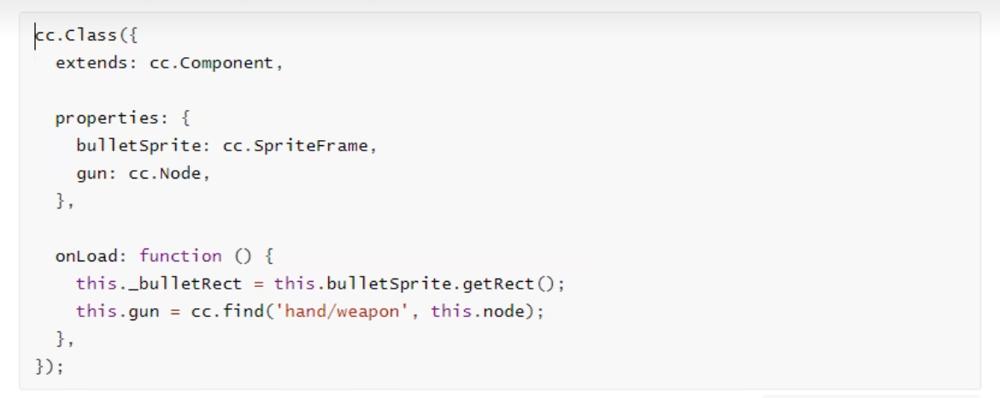

# 脚本编程

Cocos Creator 的脚本主要是通过扩展组件来进行开发的. 目前Cocos Creator 支持**JavaScript** 和 **TypeScript**两种脚本语言.通过编写脚本组件,并将它赋予到场景节点中来驱动场景中的物体.

在组件脚本的编写过程中,你可以通过声明属性,将脚本中需要调节的变量映射到**属性检查器**(Properties)中,供策划和美术调整.与此同时,你也可以通过注册特定的回调函数,来帮助你初始化,更新甚至销毁节点.

## 1 节点和组件

### 1.1 创建和使用脚本组件

- 创建脚本组件

  在cocos creator中,脚本也是资源的一部分.你可以在资源编辑器中通过点击"创建"按钮来添加病选择JavaScript或者TypeScript来创建一份组件脚本.此时你会在你的资源编辑器中得到一份新的脚本


**注意**:用户也可以通过直接拖拽脚本资源到**属性检查器**的方式来添加脚本

### 1.2 使用cc.Class 生命类型

`cc.Class` 是一个很常用的API,用于声明cocos creator中的类,为了方便区分,我们把使用cc.Class声明的类叫做**CCClass**

- 定义一个CCClass

  调用`cc.Class`,传入一个原型对象,在原型对象中以键值对的形式设定所需要的类型参数,就能创建出所需要的类.

  ```js
  let Sprite = cc.Class({
      name:"sprite",
  })
  ```

  以上代码用cc.Class创建了一个类型,并且赋值给了`Sprite`变量,同时还将类名设为"sprite",类名用于序列化,一般可以省略.

- 实例化

  `Sprite`变量保存的是一个JavaScript构造函数,可以直接new出一个对象

  ```js
  let obj = new Sprite()
  ```

- 判断类型

  需要做类型判断时,可以用JavaScript原生的`instanceof`

  ```js
  cc.log(obj instanceof Sprite); // true
  ```

- 实例方法

  ```js
  let Sprite = cc.CLass({
      // 声明一个叫 "print" 的实例方法
      print: function() {}
  })
  ```


### 1.3 声明自定义属性

#### 1.3.1 简单声明

在多数情况下,我们都可以使用简单声明.

**(1) 基本类型**

- 当声明的属性为基本JavaScript类型时,可以直接赋予默认值:

  ```JavaScript
  properties: {
          height: 20, // number
          type: "actor", // string 
          loaded: false, // boolean
          target: null, // object
          // foo: {
          //     // ATTRIBUTES:
          //     default: null,        // The default value will be used only when the component attaching
          //                           // to a node for the first time
          //     type: cc.SpriteFrame, // optional, default is typeof default
          //     serializable: true,   // optional, default is true
          // },
          // bar: {
          //     get () {
          //         return this._bar;
          //     },
          //     set (value) {
          //         this._bar = value;
          //     }
          // },
      },
  ```

- 当声明的属性具备类型时(如:`cc.Node`,`cc.Vec2`等), 可以在声明处填写他们的构造函数来完成声明,如:

  ```JavaScript
  properties:{
      target: cc.Node,
      pos: cc.Vec2,
  }
  ```

**(2) 数组类型**

当声明属性是一个数组时,可以在声明处填写他们的类型或构造函数来完成声明,如:

```JavaScript
properties:{
    any:[],					//不定义具体类型的数组
    bools:[cc.Boolean],
    strings:[cc.String],
    floats:[cc.Float],
    ...
}
```


#### 1.3.2 完整声明

有些情况下,我们需要为属性声明添加参数,这些参数控制了属性在**属性检查器**中的显示方式,以及属性在场景序列化过程中的行为.

**(1) 基本类型**

```js
properties:{
    score:{
        default:0,
        displayName:"得分",
        tooltip:"设置玩家初始得分",
    }
}
```


以上代码为`score`属性设置了三个参数`default`,`displayName`和`tooltip`.这几个参数分别指定了`score`的默认值为0,在**属性检查器**里,其属性名将显示为:"Score(player)",并且当鼠标移到参数上时,显示对应的Tooltip

下面是常用参数:

- **default**:设置属性的默认值,这个默认值仅在组件**第一次**添加到节点上时才会用到
- **type**:限定属性的数据类型
- **visible**:设为false则不再**属性检查器**面板中显示该属性
- **serializable**:设为false则不序列化(保存)该属性
- **displayName**:在**属性检查器**面板中显示成指定名字
- **tooltip**:在**属性检查器**面板中添加属性的Tooltip

**(2) 数组类型**

数组的default必须设置为`[]`,如果要在**属性检查器**中编辑,还需要设置type为构造函数,枚举,或者`cc.Integer`,`cc.Float`,`cc.Boolean`和`cc.String`.

```js
properties:{
    name:{
        default:[],
        type: [cc.String]		//	用type指定数组每个元素都是字符串类型
    },
    enemies:{
        default:[],
        type: [cc.Node]			//	type 同样写成数组,提高代码可读性
    },
}
```


### 1.4 脚本生命周期的回调函数

游戏运行的时期的自动执行相关脚本,用户不需要手工调用他们.

目前提供给用户的生命周期回调函数主要有:

- onLoad
- onEnable
- start
- update
- lateUpdate
- onDisbale
- onDestroy

#### 1.4.1 onLoad

组件脚本的初始化阶段,我们提供了`onLoad`回调函数.`onLoad`回调函数会在节点首次激活时触发,比如所在的场景被载入,或者在节点被激活的情况下,在`onLoad`阶段,保证了你可以获取到场景中的其他节点,以及节点关联的资源数据.onLoad总是会在任何start方法调用前执行,这能用于安排脚本的初始化顺序.通常我们会在`onLoad`阶段去做一些初始化相关的操作.例如:




#### 1.4.2 onEnable

当组件的`enable`属性从`false`变为`true`时,或者所在节点的`active`属性从`false`变为`true`时,会激活`onEnable`回调.倘若节点第一次被创建且`enable`为`true`,则会在`onLoad`之后,`start`之前被调用

#### 1.4.3 start

`start`回调函数会在组件第一次激活前,也就是第一次执行`update`之前触发.`start`通常用于初始化一些中间状态的数据,这些数据可能在update时会发生改变,并且被频繁的enable和disable

#### 1.4.4 update 

游戏开发中的一个关键点是在每一帧渲染前更新物体的行为,状态和方位.这些更新操作通常都放在`update`回调中.

```js
cc.Class({
    extends:cc.Component,
    
    update:function(dt){
        this.node.y+=1;
    }
})
```

#### 1.4.5 lateUpdate

`update`会在所有动画更新前执行,但如果我们要在动效(如动画,粒子,物理等)更新之后才进行一些额外操作,或希望在所有组件的`update`都执行完之后进行其他操作,那就需要用到`lateUpdate`回调.

```js
cc.Class({
    extends:cc.Component,
    lateUpdate:function(dt){
        this.node.rotation+=20;
    }
})
```

#### 1.4.6 onDisable

当组件的`enable`属性从`true`变为`false`时,或者所在节点的`active`属性从`true`变为`false`时,会激活`onDisable`回调

#### 1.4.7 onDestroy

当组件或者所在节点调用了`destroy()`,则会被调用`onDestroy()`回调,并在当帧结束时统一回收组件

#### 1.5.1 获得组件所在的节点

获得组件所在的节点很简单,只要在组件方法里访问`this.node`变量:

```js
start:function(){
	let node = this.node;
	node.x = 100;
}
```

#### 1.5.2 获得当前节点下的其它组件

你会经常需要获得同一个节点上的其它组件,这就要用到`getComponent`这个API,它会帮你查找你要的组件.

```js
start:function(){
    let label = this.getComponent(cc.Lable);
    let text = this.name + 'started';
    
    // Change the text in Label Component
    lable.string = text;
}
```


#### 1.5.3 获得其它节点及其下的组件

仅仅能访问节点咋挤的组件通常是不够的,脚本通常还需要进行多个节点之间的交互.例如,一门自动瞄准玩家的大炮,就需要不断获取玩家的最新位置.cocos creator 提供了一些不同的方法来获取其它节点或组件.

- **使用属性检查器设置节点**

  最直接的方式就是在**属性检查器**中设置你需要的对象.以节点为例,这只需要在脚本中声明一个type为`cc.Node`的属性:

  ```js
  // cannon.js
  
  cc.Class({
      extends:cc.Component,
      properties:{
          // 声明 player 属性
          player:{
              default:null,
              type:cc.Node
          }
      }
  })
  ```

  这段代码在`properties`里面声明了一个`player`属性,默认值为null,并且指定它的对象类型为`cc.Node`.这就相当于在其它语言里面声明了`public cc.Node player = null`脚本编译之后,这个组件在**属性检查器**中看起来是这样的:

  

- 使用属性检查器设置组件

  在上面的例子中,如果你将属性的type声明为player组件,当你拖动节点**Player Node**到**属性检查器**,player属性就会被设置为这个节点里面的player组件,这样你就不需要再自己调用`getComponent`啦.

  
  
  #### 1.5.4 查找子节点
  
  有时候,游戏场景中会有很多个相同类型的对象,像是炮塔,敌人和特效,他们通常都有一个全局的脚本来统一管理.如果用**属性检查器**来一个一个将它们关联到这个脚本上,那工作就会很繁琐.为了更好地统一管理这些对象,我们可以把它们放到一个统一的父物体下,然后通过父物体来获得所有的子物体:
  
  ```js
  // sya-hello.js
  
  cc.Class({
      extends: cc.Component,
      
      start:function(){
          let children = this.node.children;
          // ...
      }
  })
  ```
  
  你还可以使用`getChildByName`:
  
  ```js
  this.node.getChildByName("Cannon");
  ```
  
  如果子节点的层次较深,你还可以使用`cc.find`,`cc.dind`将根据传入的路径进行逐级查找:
  
  ```js
  cc.find("Cannon/Sub",this.node);
  ```
  
  #### 1.5.5 全局名字查找
  
  当`cc.find`只传入第一个参数时,将从场景根节点开始逐级查找:
  
  ```js
  this.backNode = cc.find("Canvas/Hello/Cannon");
  ```
  
  
  
### 1.6 常用节点和组件接口

  在通过访问节点和组件介绍的方法获取到节点或组件实例后,这篇文章将会介绍通过节点和组件实例可以通过哪些常用接口实现我们需要的种种效果和操作.

#### 1.6.1 激活/关闭节点

节点默认是激活的,我们可以再代码中设置它的激活状态,方法是设置节点的`active`属性:

```js
this.node.active = false;
```

设置`active`属性和比在编辑器中切换节点的激活,关闭状态,效果是一样的.当一个节点是关闭状态时,他的所有组件都将被禁用.同时,它所有子节点,以及子节点上的组件也会跟着被禁用.要注意的是,子节点被禁用时,并不会改变他们的`active`属性,因此当父节点重新激活的时候它们就会回到原来的状态

也就是说,`active`表示的其实是该节点**自身的**激活状态,而这个节点**当前**是否可被激活则取决于它的父节点.并且如果他不在当前场景中,它也无法被激活.我们可以通过节点上的只读属性`activeInHierarchy`来判断它当前是否已经激活.

```js
this.node.active = true;
```

若节点原先就处于**可被激活**状态,修改`active`为true就会立即触发激活操作:

- 在场景中隐藏该节点和节点下的所有子节点

- 该节点和所有子节点上的所有组件都将被禁用,也就是不会在执行这些组件中的`update`中的代码

- 这些组件上如果有`onDisable`方法,这些方法都将被执行

  

#### 1.6.2 更改节点的父节点

假设父节点为`parentNode`,子节点为`this.node`

您可以:

```js
this.node.parent = parentNode;
```

或

```js
this.node.removeFromParent(false);
parentNode.addChild(this.node);
```

这两种方法是等价的.

注意:

- `removeFromParent`通常需要传入一个false,否则默认会清空节点上绑定的事件和action等
- 通过 创建和销毁节点 介绍的方法创建出新节点后,要为节点设置一个父节点才能正确完成节点的初始化

#### 1.6.3 索引节点的子节点

`this.node.children`将返回节点的所有子节点数组

`this.node.childrenCount`将返回节点的子节点数量

**注意** 以上两个API都只会返回节点的直接节点,不会返回子节点的子节点.  不会递归呗

此外 在生命周期中 子节点中的js文件执行顺序优先于父节点执行

#### 1.6.4 更改节点的变换 (位置,旋转,缩放,尺寸)

**(1)更改节点位置**

分别对X轴Y轴坐标赋值

```js
this.node.x = 100
this.node.y = 50
```

使用`setPosition`方法

```js
this.node.setPosition(100,50);
this.node.setPosition(cc.v2(100,50))
```

设置`position`变量

```js
this.node.position = cc.v2(100,50);
```

以上两种用法等价.

**(2)更改节点旋转**

```js
this.node.rotation = 90;
```

或

```js
this.node.setRotation(90);
```

**(3) 更改节点缩放**

```js
this.node.scaleX = 2;
this.node.scaleY = 2;
```

或

```js
this.node.setScale(2);
this.node.setScale(2,2);
```

以上两种方法等价. `setScale`传入单个参数时,会同时修改`scaleX` 和 `scaleY`

**(4) 更改节点尺寸**

```js
this.node.setContentSize(100,100);
this.node.setContentSize(cc.size(100,100));
```

或

```js
this.node.width = 100;
this.node.height = 100;
```

以上两种方式等价

**(5) 更改节点锚点位置**

```js
this.node.anchorX = 1;
this.node.anchorY = 0;
```

或

```js
this.node.setAnchorPoint(1,0);
```

注意以上这些修改变换的方法会影响到节点上挂载的渲染组件,比如sprite图片的尺寸,旋转等等
